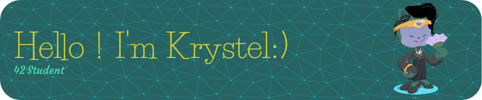

- 🔭 I’m currently doing my internship as a Junior Software Developper at [WIT France](https://www.wit.fr/)

- 🌱 I’m currently learning **Assembly** and **FPC**

- 📫 You can find me on LinkedIn 

***
### Languages
, Assembly, FPC

***
### Tools
 

***
### Familiar OS

***
### Tested Text Editors
|

***

